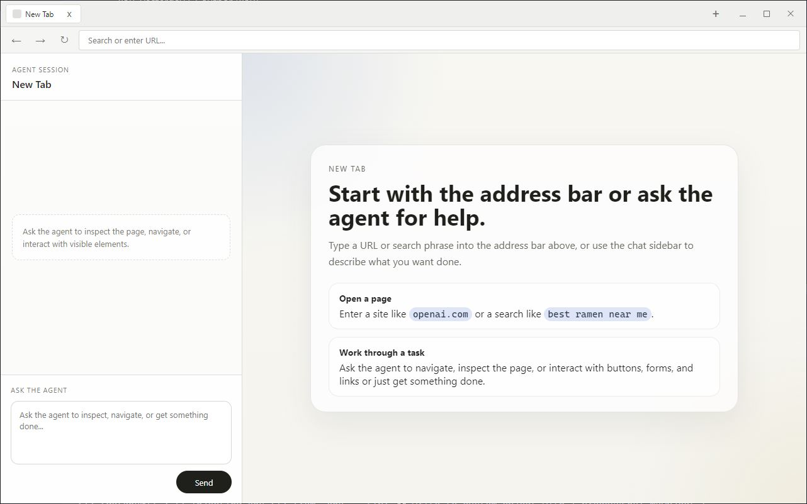

# Agentic Browser

For an overview of the entire app -> Check [App Details.md](./App%20Details.md).

An Electron-based browser with per-tab `WebContentsView` isolation, built as the foundation for an agentic browsing experience.

> This is a test app and obviously meant as a learning exercise and not a production application.



## Setup

```bash
npm install
npm start
```

To start the app:

```bash
npm run dev
```

## Architecture Notes

- Each tab gets its own `WebContentsView` with isolated `webPreferences`
- The chrome UI (tab bar + address bar) is rendered in the main `BrowserWindow` at a fixed 84px height
- `WebContentsView` instances are repositioned to fill the remaining space below the chrome
- All renderer <-to-from-> main communication goes through the typed `browserAPI` preload bridge
- Tab state is pushed from main → renderer via IPC events (`tab:updated`, `tab:list-updated`)

## Next Steps

- [x] Wire up `webContents.debugger` per tab for CDP access
- [x] Connect Playwright via `chromium.connectOverCDP()` per tab
- [x] Add agent manager and session manager
- [x] Instantiate agent and connect session per tab initialization
- [x] Add tool definitions and agent loop
- [x] Add the agent chat panel per tab
- [x] Markdown rendering on the frontend for messages.
- [ ] Implement snapshot/compaction logic for message stream per tab (Cloning messages for user view but compacting messages for agent view)
- [ ] Integrate the whole message back and forth flow from the agent with details on when a tool call is executing.
- [ ] While the message and content processing happens, we have to block the textarea on the user's end from sending any more messages (Or add a "steer" operation similar to Codex which allows the user to send a message right after the next tool call).

### More that can be done for this 
